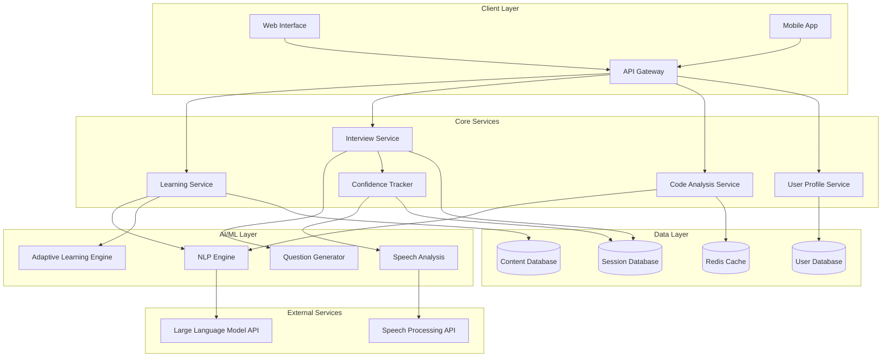

# Design Document: AI-Powered Learning Assistant

## Overview

The AI-powered learning assistant is designed as a modular, microservices-based system that provides personalized learning experiences for students and early-career developers. The system leverages modern AI/ML techniques including natural language processing, adaptive learning algorithms, and speech analysis to deliver comprehensive educational support.

The architecture follows a cloud-native, event-driven design that enables scalability, maintainability, and real-time responsiveness. Key design principles include separation of concerns, data-driven personalization, and privacy-first implementation.

## Architecture

### High-Level Architecture



### Microservices Architecture

The system is decomposed into focused microservices, each handling specific domain responsibilities:

**API Gateway**: Central entry point providing authentication, rate limiting, request routing, and response aggregation. Implements circuit breaker patterns for resilience.

**Learning Service**: Manages concept explanations, prerequisite tracking, and adaptive content delivery. Integrates with the NLP engine for content generation and the adaptive learning engine for personalization.

**Interview Service**: Orchestrates interview sessions, manages question flows, and coordinates with the confidence tracker. Handles both standard and interrupted interview modes.

**Code Analysis Service**: Processes code snippets and error messages, providing explanations and improvement suggestions. Utilizes caching for frequently analyzed patterns.

**User Profile Service**: Maintains user progress, preferences, and learning analytics. Implements privacy controls and data retention policies.

**Confidence Tracker**: Analyzes speech patterns, response timing, and behavioral indicators to assess and improve user confidence levels.

### Event-Driven Communication

Services communicate through asynchronous events using a message broker (Apache Kafka or AWS EventBridge):

- **Learning Progress Events**: Triggered when users complete explanations or demonstrate mastery
- **Interview Session Events**: Capture question responses, timing, and confidence metrics  
- **Confidence Assessment Events**: Real-time confidence scoring and feedback triggers
- **Personalization Events**: Adaptive learning adjustments based on user performance

## Components and Interfaces

### Learning Module

**Purpose**: Delivers personalized concept explanations and manages learning progression.

**Key Components**:
- **Explanation Generator**: Creates beginner-friendly explanations using LLM integration
- **Prerequisite Tracker**: Identifies and manages concept dependencies
- **Complexity Adapter**: Adjusts explanation difficulty based on user profile
- **Example Provider**: Generates relevant, practical examples for concepts

**Interfaces**:
```typescript
interface LearningModule {
  explainConcept(concept: string, userLevel: SkillLevel): Promise<Explanation>
  getPrerequisites(concept: string): Promise<string[]>
  adaptComplexity(explanation: Explanation, feedback: UserFeedback): Promise<Explanation>
  generateExamples(concept: string, context: string): Promise<Example[]>
}

interface Explanation {
  concept: string
  content: string
  examples: Example[]
  prerequisites: string[]
  complexity: ComplexityLevel
  estimatedReadTime: number
}
```

### Interview Simulator

**Purpose**: Manages realistic interview sessions with adaptive questioning and interruption simulation.

**Key Components**:
- **Question Generator**: Creates contextually appropriate technical questions
- **Session Manager**: Orchestrates interview flow and timing
- **Interruption Engine**: Implements realistic interruption patterns
- **Performance Tracker**: Monitors response quality and timing

**Interfaces**:
```typescript
interface InterviewSimulator {
  startSession(config: InterviewConfig): Promise<SessionId>
  getNextQuestion(sessionId: SessionId): Promise<Question>
  submitAnswer(sessionId: SessionId, answer: Answer): Promise<Feedback>
  triggerInterruption(sessionId: SessionId): Promise<Interruption>
  endSession(sessionId: SessionId): Promise<SessionSummary>
}

interface Question {
  id: string
  type: QuestionType
  difficulty: DifficultyLevel
  content: string
  expectedDuration: number
  topics: string[]
}

interface InterviewConfig {
  targetRole: string
  skillLevel: SkillLevel
  duration: number
  interruptionMode: boolean
  focusAreas: string[]
}
```

### Code Explainer

**Purpose**: Analyzes and explains code snippets, error messages, and programming patterns.

**Key Components**:
- **Code Parser**: Analyzes code structure and syntax across multiple languages
- **Error Analyzer**: Interprets error messages and suggests fixes
- **Pattern Detector**: Identifies code patterns and best practices
- **Learning Opportunity Finder**: Highlights educational concepts within code

**Interfaces**:
```typescript
interface CodeExplainer {
  explainCode(code: string, language: string): Promise<CodeExplanation>
  analyzeError(error: string, context: string): Promise<ErrorAnalysis>
  suggestImprovements(code: string, language: string): Promise<Improvement[]>
  identifyPatterns(code: string): Promise<Pattern[]>
}

interface CodeExplanation {
  lineByLineExplanation: LineExplanation[]
  overallPurpose: string
  keyPatterns: Pattern[]
  learningOpportunities: string[]
  relatedConcepts: string[]
}

interface ErrorAnalysis {
  errorType: string
  cause: string
  suggestedFixes: Fix[]
  preventionTips: string[]
  relatedConcepts: string[]
}
```

### Confidence Tracker

**Purpose**: Assesses user confidence through speech analysis and behavioral indicators.

**Key Components**:
- **Speech Analyzer**: Processes vocal patterns for confidence indicators
- **Behavioral Monitor**: Tracks response timing and interaction patterns
- **Confidence Scorer**: Generates confidence metrics and trends
- **Feedback Generator**: Provides targeted confidence-building suggestions

**Interfaces**:
```typescript
interface ConfidenceTracker {
  analyzeResponse(audio: AudioData, text: string, timing: ResponseTiming): Promise<ConfidenceScore>
  trackProgress(userId: string, timeframe: TimeRange): Promise<ConfidenceProgress>
  generateFeedback(scores: ConfidenceScore[]): Promise<ConfidenceFeedback>
  suggestExercises(weakAreas: string[]): Promise<Exercise[]>
}

interface ConfidenceScore {
  overall: number
  speechClarity: number
  paceConsistency: number
  fillerWordFrequency: number
  pausePatterns: number
  responseTime: number
}

interface ConfidenceFeedback {
  strengths: string[]
  improvementAreas: string[]
  specificSuggestions: string[]
  recommendedExercises: Exercise[]
}
```

### Adaptive Learning Engine

**Purpose**: Personalizes learning experiences based on user performance and preferences.

**Key Components**:
- **User Modeler**: Maintains detailed learner profiles and progress tracking
- **Difficulty Adjuster**: Dynamically adjusts content complexity
- **Path Optimizer**: Recommends optimal learning sequences
- **Performance Predictor**: Anticipates user struggles and success areas

**Interfaces**:
```typescript
interface AdaptiveLearningEngine {
  updateUserModel(userId: string, interaction: LearningInteraction): Promise<void>
  recommendNextConcept(userId: string): Promise<string>
  adjustDifficulty(userId: string, concept: string, performance: Performance): Promise<DifficultyLevel>
  predictPerformance(userId: string, concept: string): Promise<PerformancePrediction>
}

interface LearningInteraction {
  concept: string
  timeSpent: number
  questionsAsked: number
  comprehensionLevel: number
  struggledAreas: string[]
}

interface UserModel {
  skillLevels: Map<string, SkillLevel>
  learningPreferences: LearningPreferences
  progressHistory: ProgressEntry[]
  strugglingAreas: string[]
  masteredConcepts: string[]
}
```

## Data Models

### User Profile

```typescript
interface UserProfile {
  id: string
  email: string
  createdAt: Date
  lastActive: Date
  
  // Learning Profile
  skillLevel: SkillLevel
  targetRole: string
  learningGoals: string[]
  preferredExplanationStyle: ExplanationStyle
  
  // Progress Tracking
  conceptsLearned: ConceptProgress[]
  interviewSessionsCompleted: number
  totalLearningTime: number
  confidenceScores: ConfidenceHistory[]
  
  // Preferences
  interruptionTolerance: number
  preferredSessionLength: number
  notificationSettings: NotificationSettings
  
  // Privacy Settings
  dataRetentionPreference: DataRetentionLevel
  analyticsOptIn: boolean
}

interface ConceptProgress {
  concept: string
  masteryLevel: number
  timeSpent: number
  lastReviewed: Date
  strugglingAreas: string[]
}
```

### Interview Session

```typescript
interface InterviewSession {
  id: string
  userId: string
  startTime: Date
  endTime?: Date
  status: SessionStatus
  
  // Configuration
  targetRole: string
  difficulty: DifficultyLevel
  interruptionMode: boolean
  focusAreas: string[]
  
  // Session Data
  questions: QuestionResponse[]
  overallScore: number
  confidenceScores: ConfidenceScore[]
  interruptions: InterruptionEvent[]
  
  // Analytics
  totalResponseTime: number
  averageConfidence: number
  improvementAreas: string[]
  strengths: string[]
}

interface QuestionResponse {
  questionId: string
  question: string
  userAnswer: string
  audioData?: AudioData
  responseTime: number
  score: number
  feedback: string
  confidenceScore: ConfidenceScore
}
```

### Learning Content

```typescript
interface LearningContent {
  id: string
  concept: string
  type: ContentType
  difficulty: DifficultyLevel
  
  // Content Data
  explanation: string
  examples: Example[]
  prerequisites: string[]
  relatedConcepts: string[]
  
  // Metadata
  estimatedReadTime: number
  tags: string[]
  lastUpdated: Date
  version: number
  
  // Analytics
  viewCount: number
  averageRating: number
  commonQuestions: string[]
}

interface Example {
  title: string
  description: string
  code?: string
  language?: string
  explanation: string
  difficulty: DifficultyLevel
}
```

## Correctness Properties

*A property is a characteristic or behavior that should hold true across all valid executions of a system—essentially, a formal statement about what the system should do. Properties serve as the bridge between human-readable specifications and machine-verifiable correctness guarantees.*

Now I need to analyze the acceptance criteria from the requirements to create testable properties. Let me use the prework tool to systematically analyze each acceptance criterion.

Based on the prework analysis and property reflection, the following correctness properties ensure the system meets its requirements:

### Property 1: Concept Explanation Completeness
*For any* technical concept request, the Learning_Module should provide an explanation that includes practical examples, identifies prerequisites when they exist, and adapts complexity to the user's skill level within the required time limit.
**Validates: Requirements 1.1, 1.2, 1.3, 1.4**

### Property 2: Alternative Explanation Provision  
*For any* user confusion indication, the Learning_Module should provide alternative explanations using different approaches from the original explanation.
**Validates: Requirements 1.5**

### Property 3: Interview Question Appropriateness
*For any* user profile with defined skill level and target role, generated interview questions should match the skill level, cover multiple technical areas (algorithms, data structures, system design, coding), and include varying difficulty levels within sessions.
**Validates: Requirements 2.1, 2.2, 2.3**

### Property 4: Interview Session Tracking and History
*For any* completed interview question, the system should track response time and accuracy, and maintain question history to prevent immediate repetition across sessions.
**Validates: Requirements 2.4, 2.5**

### Property 5: Interruption Simulation Behavior
*For any* interview session with interrupt mode enabled, the system should randomly interrupt at realistic intervals, present follow-up content after interruptions, provide different interruption types, and offer feedback on interruption handling.
**Validates: Requirements 3.1, 3.2, 3.4, 3.5**

### Property 6: Interruption Recovery Evaluation
*For any* user interruption during interview responses, the Answer_Analyzer should evaluate recovery and continuation ability.
**Validates: Requirements 3.3**

### Property 7: Comprehensive Response Analysis
*For any* user answer submission, the system should evaluate technical accuracy, clarity, completeness, assess confidence indicators from speech patterns and timing, and provide specific improvement suggestions.
**Validates: Requirements 4.1, 4.2, 4.3**

### Property 8: Confidence-Based Exercise Recommendation
*For any* detected confidence issues, the Confidence_Tracker should offer targeted exercises to build confidence in the identified weak areas.
**Validates: Requirements 4.4**

### Property 9: Progress Tracking and Improvement
*For any* series of user interactions over time, the system should track improvement across different topics and skills, and highlight progress areas.
**Validates: Requirements 4.5, 6.1**

### Property 10: Comprehensive Code Analysis
*For any* submitted code snippet, the Code_Explainer should provide line-by-line functionality explanation, identify patterns and best practices, highlight learning opportunities and related concepts, and support multiple programming languages.
**Validates: Requirements 5.1, 5.3, 5.4, 5.5**

### Property 11: Error Analysis and Resolution
*For any* provided error message, the Code_Explainer should explain the error cause and suggest specific fixes.
**Validates: Requirements 5.2**

### Property 12: Adaptive Difficulty Adjustment
*For any* demonstrated user mastery in a topic, the AI_Assistant should automatically increase the difficulty level for that specific topic.
**Validates: Requirements 6.2**

### Property 13: User Preference Management
*For any* user preference settings for explanation styles and learning approaches, the User_Profile should store and apply these preferences in subsequent interactions.
**Validates: Requirements 6.3**

### Property 14: Struggle Pattern Recognition
*For any* detected patterns in user struggles, the AI_Assistant should recommend focused practice areas relevant to the struggling topics.
**Validates: Requirements 6.4**

### Property 15: Session History Maintenance
*For any* user session, the User_Profile should maintain accessible history that allows users to review past interactions.
**Validates: Requirements 6.5**

### Property 16: Progress Indication for Complex Requests
*For any* complex request processing, the AI_Assistant should provide progress indicators to keep users informed of processing status.
**Validates: Requirements 7.2**

### Property 17: Response Caching Optimization
*For any* frequently requested explanation, the AI_Assistant should cache the content to improve response times for subsequent identical requests.
**Validates: Requirements 7.5**

### Property 18: UI Navigation Efficiency
*For any* core functionality access, the User_Interface should require no more than 2 clicks to reach the feature, and provide clear visual feedback for all user actions and system responses.
**Validates: Requirements 8.2, 8.3**

### Property 19: Cross-Device Responsiveness
*For any* device type (desktop or mobile), the User_Interface should maintain responsive behavior and accessibility.
**Validates: Requirements 8.5**

### Property 20: Comprehensive Data Protection
*For any* user data processing, the AI_Assistant should encrypt data in transit and at rest, anonymize personally identifiable information in stored interactions, and not store or share proprietary code without explicit consent.
**Validates: Requirements 9.1, 9.2, 9.4**

### Property 21: User Data Control
*For any* user data retention and deletion request, the AI_Assistant should provide functional controls that allow users to manage their data according to their preferences.
**Validates: Requirements 9.3**

## Error Handling

### Error Categories and Strategies

**AI/ML Service Failures**:
- **Circuit Breaker Pattern**: Implement circuit breakers for external AI services (LLM APIs, speech processing)
- **Graceful Degradation**: Fall back to cached responses or simplified explanations when AI services are unavailable
- **Retry Logic**: Exponential backoff for transient failures with maximum retry limits

**User Input Validation**:
- **Input Sanitization**: Validate and sanitize all user inputs to prevent injection attacks
- **Content Filtering**: Filter inappropriate content in code submissions and questions
- **Rate Limiting**: Implement per-user rate limits to prevent abuse

**Data Consistency**:
- **Event Sourcing**: Use event sourcing for critical user progress data to ensure consistency
- **Compensating Transactions**: Implement saga patterns for multi-service operations
- **Data Validation**: Validate data integrity at service boundaries

**Performance Degradation**:
- **Load Shedding**: Prioritize core functionality during high load periods
- **Caching Strategies**: Multi-level caching (Redis, CDN) for frequently accessed content
- **Async Processing**: Queue non-critical operations for background processing

### Error Response Patterns

```typescript
interface ErrorResponse {
  code: string
  message: string
  details?: any
  retryable: boolean
  fallbackAction?: string
}

// Example error handling for explanation requests
async function handleExplanationRequest(concept: string): Promise<Explanation | ErrorResponse> {
  try {
    return await learningService.explainConcept(concept)
  } catch (error) {
    if (error instanceof AIServiceUnavailable) {
      // Try cached explanation first
      const cached = await cache.get(`explanation:${concept}`)
      if (cached) return cached
      
      // Fall back to basic explanation
      return await generateBasicExplanation(concept)
    }
    
    return {
      code: 'EXPLANATION_FAILED',
      message: 'Unable to generate explanation at this time',
      retryable: true,
      fallbackAction: 'Try a simpler concept or check back later'
    }
  }
}
```

## Testing Strategy

### Dual Testing Approach

The testing strategy employs both unit testing and property-based testing to ensure comprehensive coverage:

**Unit Tests**: Focus on specific examples, edge cases, and integration points between components. Unit tests validate concrete scenarios and error conditions, ensuring individual components work correctly in isolation.

**Property Tests**: Verify universal properties across all inputs using randomized test data. Property-based tests validate the correctness properties defined above, ensuring the system behaves correctly across the full input space.

### Property-Based Testing Implementation

**Testing Framework**: Use Hypothesis (Python) or fast-check (TypeScript/JavaScript) for property-based testing implementation.

**Test Configuration**: Each property test runs a minimum of 100 iterations to ensure statistical confidence in the results.

**Test Tagging**: Each property-based test includes a comment tag referencing its corresponding design property:
- Format: **Feature: ai-learning-assistant, Property {number}: {property_text}**

**Example Property Test Structure**:
```python
from hypothesis import given, strategies as st
import pytest

@given(
    concept=st.text(min_size=1, max_size=100),
    skill_level=st.sampled_from(['beginner', 'intermediate', 'advanced'])
)
def test_concept_explanation_completeness(concept, skill_level):
    """
    Feature: ai-learning-assistant, Property 1: Concept Explanation Completeness
    For any technical concept request, the Learning_Module should provide an explanation 
    that includes practical examples, identifies prerequisites when they exist, and 
    adapts complexity to the user's skill level within the required time limit.
    """
    user_profile = create_user_profile(skill_level=skill_level)
    
    start_time = time.time()
    explanation = learning_module.explain_concept(concept, user_profile)
    response_time = time.time() - start_time
    
    # Verify response time requirement
    assert response_time <= 3.0
    
    # Verify explanation includes examples
    assert len(explanation.examples) > 0
    
    # Verify complexity matches user level
    assert explanation.complexity.matches_skill_level(skill_level)
    
    # Verify prerequisites are identified when they exist
    if has_prerequisites(concept):
        assert len(explanation.prerequisites) > 0
```

### Unit Testing Focus Areas

**Component Integration**: Test interactions between microservices, ensuring proper error handling and data flow.

**Edge Cases**: Validate behavior with empty inputs, malformed data, and boundary conditions.

**Error Conditions**: Test all error scenarios including service failures, network issues, and invalid user inputs.

**Security Validation**: Verify authentication, authorization, and data protection mechanisms.

### Testing Coverage Requirements

- **Code Coverage**: Minimum 85% line coverage for all services
- **Property Coverage**: Each correctness property must have corresponding property-based tests
- **Integration Coverage**: All service-to-service interactions must have integration tests
- **Performance Testing**: Load testing for concurrent users and response time validation
- **Security Testing**: Penetration testing and vulnerability scanning for all endpoints

### Continuous Testing Pipeline

**Pre-commit**: Run unit tests and linting on code changes
**Pull Request**: Execute full test suite including property tests and integration tests  
**Staging Deployment**: Run end-to-end tests and performance benchmarks
**Production Monitoring**: Continuous monitoring with automated alerts for property violations